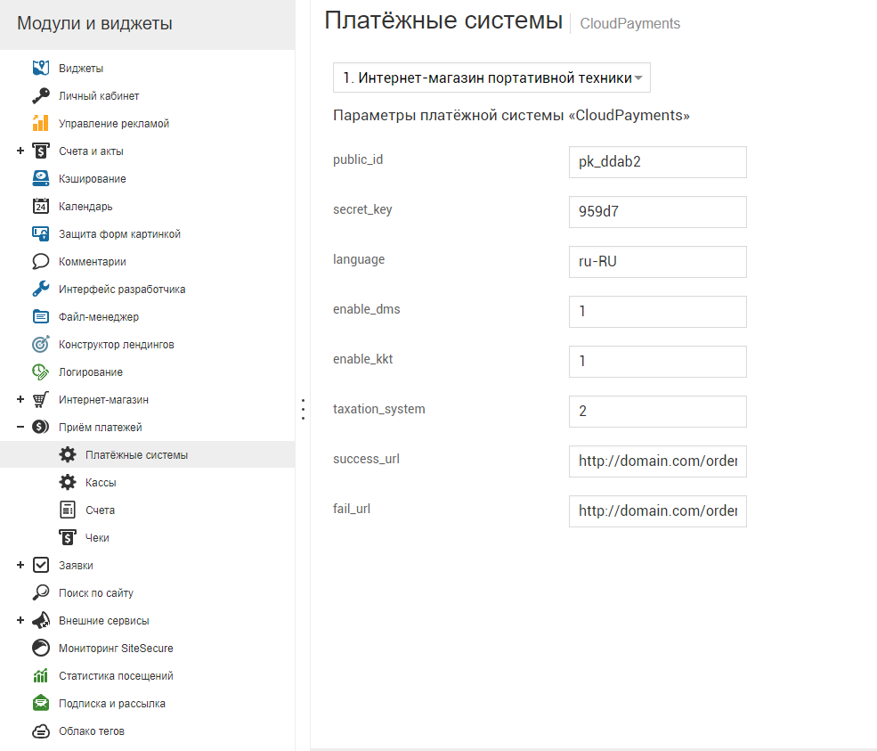
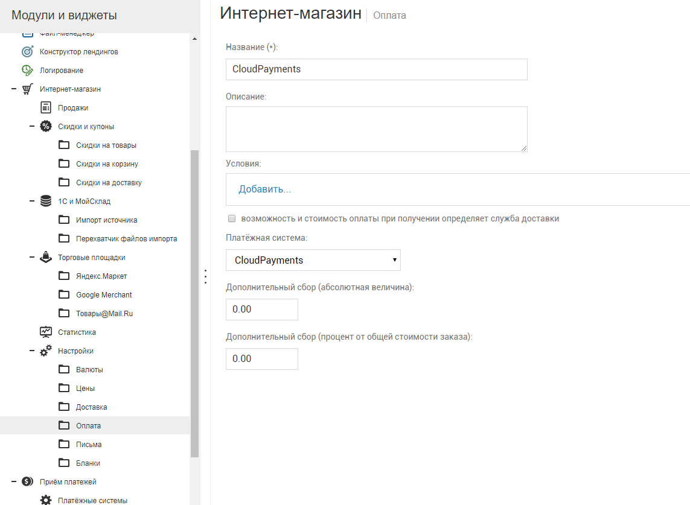
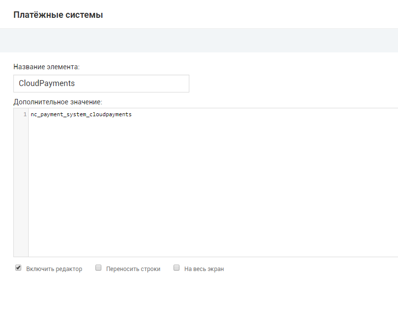

Модуль позволит с легкостью добавить на ваш сайт оплату банковскими картами через платежный сервис CloudPayments. 
Для корректной работы модуля необходима регистрация в сервисе.

Порядок регистрации описан в [документации CloudPayments](https://cloudpayments.ru/Docs/Connect)
## Возможности
	
* Одностадийная схема оплаты;  
* Двухстадийная схема оплаты;  
* Поддержка онлайн-касс (ФЗ-54);  
* Отправка чеков по email;  
* Отправка чеков по SMS;  

## Техническая настройка
### Личный кабинет CloudPayments
В личном кабинете CloudPayments в настройках сайта необходимо включить следующие уведомления:

* **Запрос на проверку платежа** (Сheck):\
http://domain.ru/netcat/modules/payment/callback.php?paySystem=nc_payment_system_cloudpayments&nc_action=check
* **Уведомление о принятом платеже** (Pay):\
http://domain.ru/netcat/modules/payment/callback.php?paySystem=nc_payment_system_cloudpayments&nc_action=pay
* **Уведомление об отклоненном платеже** (Fail):\
http://domain.ru/netcat/modules/payment/callback.php?paySystem=nc_payment_system_cloudpayments&nc_action=fail
* **Уведомление о подтверждении платежа** (Confirm):\
http://domain.ru/netcat/modules/payment/callback.php?paySystem=nc_payment_system_cloudpayments&nc_action=confirm
Требуется только при двухстадийной оплате.
* **Уведомление о возврате платежа** (Refund):\
http://domain.ru/netcat/modules/payment/callback.php?paySystem=nc_payment_system_cloudpayments&nc_action=refund

Где domain.ru — доменное имя вашего сайта. Во всех случаях требуется выбирать вариант по умолчанию: кодировка — UTF-8, HTTP-метод — POST, формат — CloudPayments

### Панель администратора NetCat
В настройках платежей (Настройка -> Прием платежей) необходимо включить модуль CloudPayments и указать следующие настройки:
* **public_id** — Public id сайта из личного кабинета CloudPayments;
* **secret_key** — API Secret из личного кабинета CloudPayments;
* **success_url** — url страницы, на которую будет перенаправлен пользователь после оплаты;
* **fail_url** — url страницы, на которую будет перенаправлен пользователь в случае отмены или ошибки при оплате;
* **language** — Язык виджета. Если не указан, то значение определяется на основе языка сайта;
* **enable_dms** — Включение/отключение двухстадийной оплаты. Возможные значения 0 или 1;
При использовании интеграции с онлайн-кассой
* **enable_kkt** — Включение/отключение формирования онлайн-чека при оплате. Возможные значения 0 или 1;
* **taxation_system** — Тип системы налогообложения. [Возможные значения](https://cloudpayments.ru/Docs/Directory#taxation-system ) перечислены в документации CloudPayments;

После указания всех данных сохранить настройки.

Затем необходимо добавить способ оплаты в интернет-магазин. Для этого в настройках интернет-магазина (Магазин -> Настройки магазина, затем в дереве слева выбрать раздел "Оплата") необходимо добавить новый способ оплаты, где в качестве платежной системы выбрать "CloudPayments"

## Ручная установка
1) Скопируйте файл cloudpayments.php в каталог netcat/modules/payments/default;  
2) В файле netcat/modules/payments/default/functions.inc.php добавьте все строки (за исключением первой строки <?php) из файла cloudpayments_functions.inc.php;  
3) В файле netcat/modules/payments/default/ru.lang.php добавьте все строки (за исключением первой строки <?php) из файла cloudpayments_ru_utf8.lang.php;  
4) В файле netcat/modules/payments/default/en.lang.php добавьте все строки (за исключением первой строки <?php) из файла cloudpayments_en.lang.php;  
5) В панели управление NetCat в разделе "Разработка" -> "Списки" добавьте в список "Платежные системы" платежную систему CloudPayments, где в качестве дополнительного параметра укажите "nc_payment_system_cloudpayments";  

